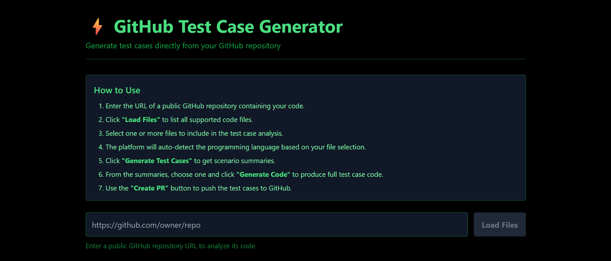
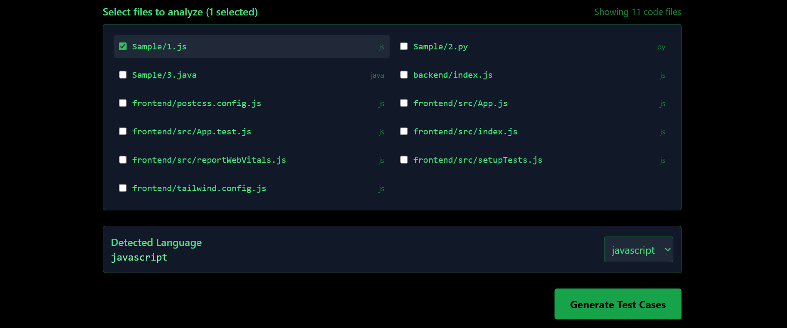
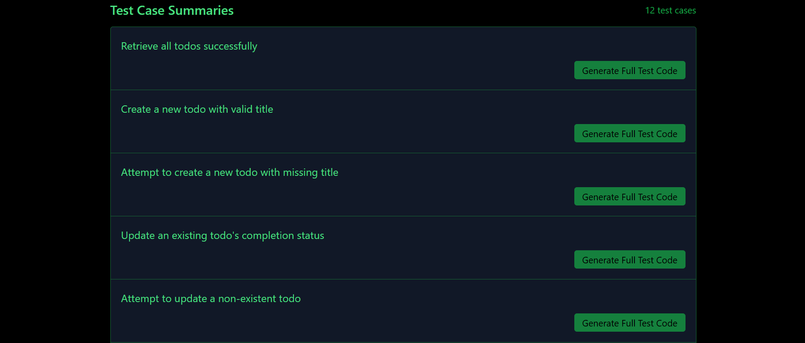
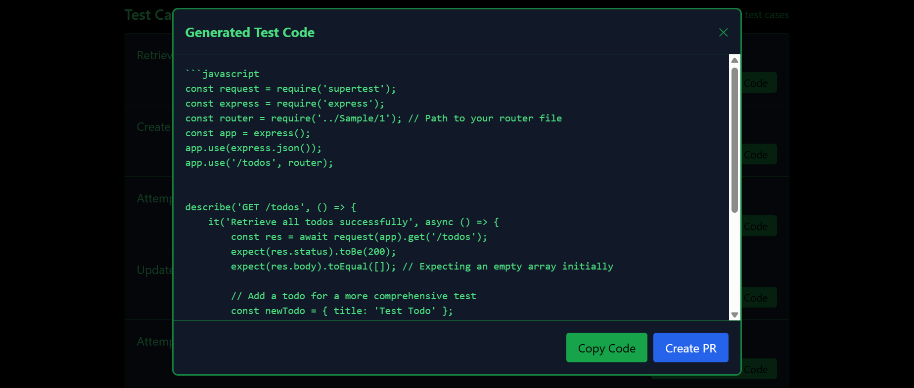

# 🧪 Test Case Generator

A web application that analyzes source code and automatically generates test case scenarios and full unit test code using **Google's Gemini API**.
Built with **React** (frontend) and **Express**.js (backend), and deployed on **Render**.

Developed as part of an internship assignment, with additional enhancements for production readiness.

---

## 🚀 Live Website
[https://testcase-generator-6npc.onrender.com](https://testcase-generator-6npc.onrender.com)  
---

## 📸 Screenshots

### Test-case Generator using GitHub API


### Files selector


### Test case summaries by Gemini API


### Generated Test Cases using Gemini API


---

## ⚙️ Features
- Upload multiple code files.
- AI-powered test case **summaries**.
- Generate **full unit test code** in:
  - JUnit (Java)
  - PyTest (Python)
  - Jest (JavaScript)
  - NUnit (C#)
- One-click **GitHub PR creation** with generated tests.

---

## 🛠️ Tech Stack
- **Frontend:** React, Tailwind CSS
- **Backend:** Node.js, Express.js, Google Generative AI SDK
- **Hosting:** Render
- **Version Control:** Git + GitHub

---

## 📂 Folder Structure
```
testcase_generator/
│
├── assets/               # Screenshots for README
├── frontend/             # React app
├── backend/              # Express.js server
├── Sample/               # Sample codes to generate test cases
└── README.md
```

---

## 🧑‍💻 Setup & Installation

### 1️⃣ Clone the Repository
```bash
git clone https://github.com/aryanpratik11/testcase_generator.git
cd testcase_generator
```

### 2️⃣ Backend Setup
```bash
cd backend
npm install
```
Create a `.env` file:
```
PORT=5000 #or any port of your choice
GEMINI_API_KEY=your_api_key_here
```
Run the backend:
```bash
node index.js
```

### 3️⃣ Frontend Setup
```bash
cd ../frontend
npm install
npm start
```

---

## 📡 API Endpoints
| Method | Endpoint | Description |
|--------|----------|-------------|
| POST   | `/api/generate` | Generates test case summaries from code |
| POST   | `/api/generateCode` | Generates full unit test code |
| POST   | `/api/create-pr` | Creates a GitHub PR with generated tests |

---


## 🌐 Deployment
- **Frontend:** Hosted on Render, connected to `main` branch.
- **Backend:** Hosted on Render, with `.env` set via Render's Environment settings.

---

## 🤝 Contributing
Contributions are welcome!  
1. Fork the repo  
2. Create your branch (`git checkout -b branch_name`)  
3. Commit changes (`git commit -m "Exact feature you are implementing"`) 
4. Push to branch (`git push origin branch_name`)  
5. Open a Pull Request

Extra features like allowing test cases editing before PR creation or any such features are invited.

---